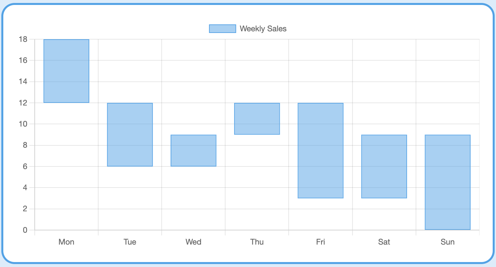

This repo contains snippets that do not work yet. This readme details the current state of code in each of the associated folders. Enter at your own risk.

File index

9.4.24-draggable-box-html - For creating a Miro-like card canvas for desktop browser

9.4.24-landing_pages-perplexity - Asked for a landing page for an app. Looking for fastest path of travel 
    p3.html (active) - App landing page with blue background
    
chartjs - Looking for a responsive HTML based chart to display candlestick data. Ultimately want to use this with Forthic.
    chartjs_getStarted.html (active)
        

forgettingCurve - For visualizing optimal spaced repetition periods for high-volume learning
    claude - Claude allows image uploads. Asked for the photo in React and Python.
    perplexity - Asked for a line chart between two non-zero datapoints in Javascript

ios
    A-nav-stack
        7.31.24-nav_stack_play_2 (Fix needed) - Button to launch view of NavStack list. List currently just goes back to the home button.
        7.25.24-view-play1(Fix needed) - Button to move to new view, but doesn't save the entered text.
        9.10.24_budget-waterfall-1(Fix needed) - Calculated field that allocates remaining Total Budget to a line item. Currently doesn't calculate. Ultimately hoping to allocate in order of user-selected draggable sorting.
    A-budget-play
        budget-play-5 (active)
        budget-play-6 (Fix needed)
        budget-play-7 (Fix needed)
    A-candlestick-demo - Trying to create a candlestick chart to replace Apple Stocks for mobile trading. Have since discovered TradingView.
    A-draggable - Trying to create a draggable card canvas to replace Miro/Milanote
    A-view-play - Playing with saving data and programming other views with buttons
    
scraping - For jobs scraping project
    9.5.24-jpmorgan.py (Fix needed) - Perplexity generated code to pull JPMorgan jobs. Currently returns "no jobs found"
    scrape1.py (Fix needed) - Tutorial for Amazon scraper. Currently pulls from Germany and throws an error.

venv - For learning Flask - learning how to install a virtual environment and use a Makefile